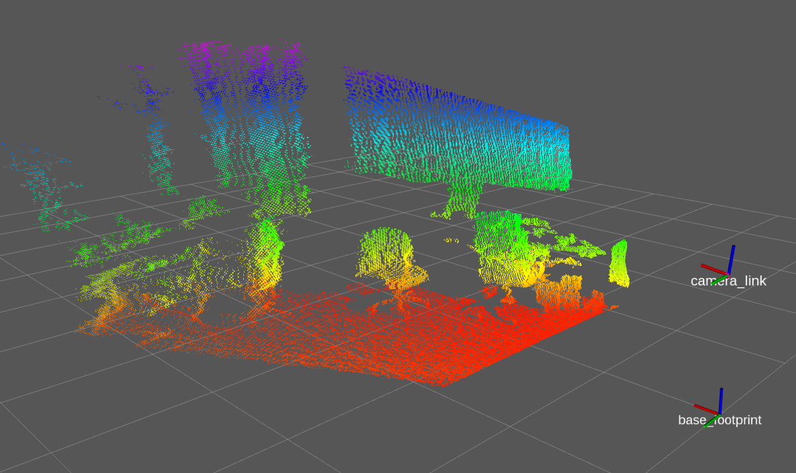
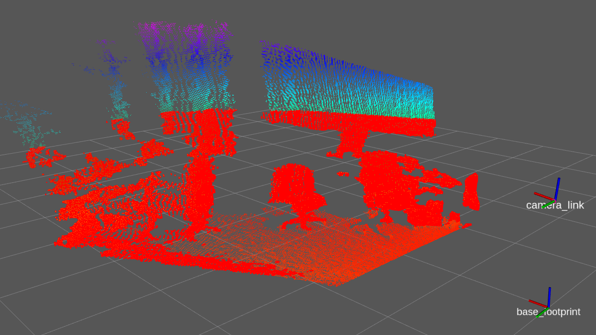
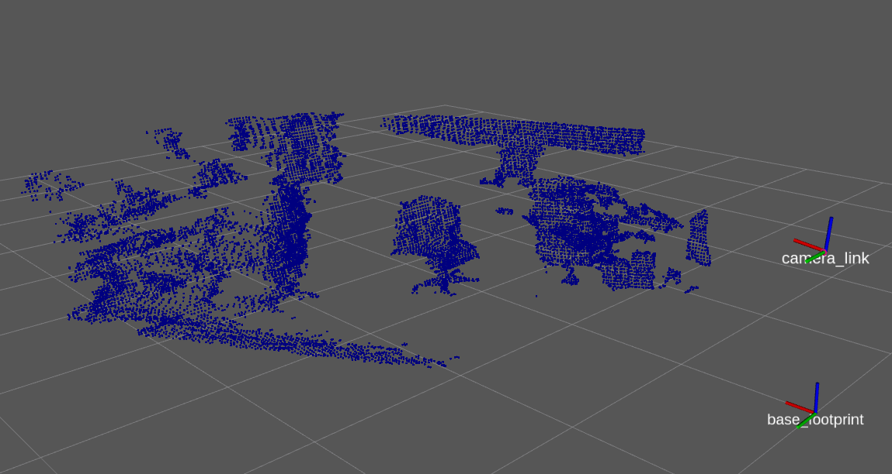
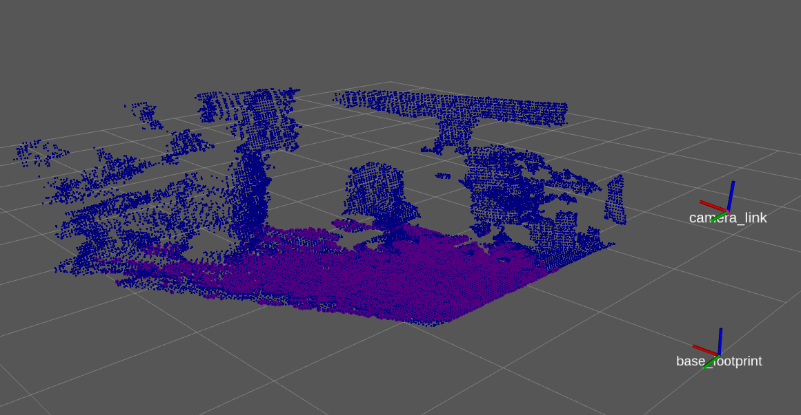
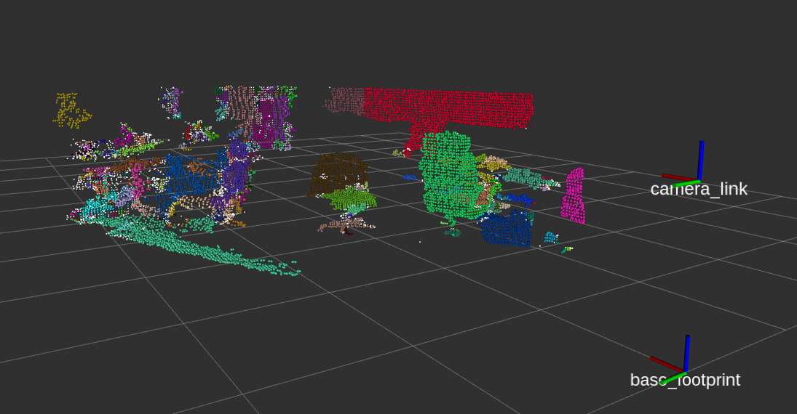
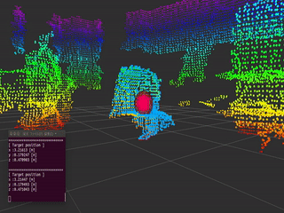

# pcl_tutorial_ros
Point Cloud Libraryのチュートリアル

# 前提知識
0. ROSに関する知識(topicやtfなど)
1. C++に関する知識(関数やオブジェクト指向など)

## **目次**

0. [**setup**](#setup)

1. [**Point Cloud Library (PCL) とは**](#point-cloud-library-pcl-%E3%81%A8%E3%81%AF)
    - PCLのデータ構造
        1. [PointCloud](#1-pointcloud)
        2. [PointIndices](#2-pointindices)
        3. [ModelCoefficients](#3modelcoefficients)  

---

2. [**Before Tutorial**](#before-tutorial)
    1. [pointcloud_publisher](#pointcloud_publisher)  

---

3. **Tutorial**
    - [**Basic**](#tutorial-basic)
        1. [pointcloud_subscriber](#1pointcloud_subscriber)
        2. [PassThrough](#2passthrough)
        3. [VoxelGrid](#3-voxelgrid)
        4. [Clustering](#4clustering)
    - [**Advanced**](#tutorial-advanced)
        1. [PlaneDetection](#1plane-detection)
        2. [RegionGrowingSegmentation](#2region-growing-segmentation)  
        3. [Tracker](#3tracker)  

---

4. [**便利な関数たち**](#%E4%BE%BF%E5%88%A9%E3%81%AA%E9%96%A2%E6%95%B0%E3%81%9F%E3%81%A1)
    1. [pcl_common](#1pcl_common)
        - pcl::getMinMax3D
        - pcl::compute3DCentroid
    2. [NearestNeighborSearch](#2nearest-neighbor-search)
        - K nearest neighbor search
        - Neighbors within radius search
    3. [pcl::fromROSMsg/pcl::toROSMsg](#3pclfromrosmsg-pcltorosmsg)
        - pcl::fromROSMsg
        - pcl::toROSMsg
    4. [transformLaserScanToPointCloud](#4transformlaserscantopointcloud)

---
6. [**終わりに**](#%E7%B5%82%E3%82%8F%E3%82%8A%E3%81%AB)

---

5. [**Reference**](#reference)

## setup
### 1.git clone
```bash
$ cd ~/catkin_ws/src/
$ git clone https://github.com/DaikiMin/pcl_tutorial_ros.git
```

### 2.エラーの対処
ROS MelodicではPCL1.8を使用しています．
PCL1.8にはsample_consensusにエラーがあります．
そのため，エラーを修正する必要があります．

エラー文
```bash
c:\program files\pcl 1.8.1\include\pcl-1.8\pcl\sample_consensus\model_types.h(99): error C4996: 'pcl::SAC_SAMPLE_SIZE': This map is deprecated and is kept only to prevent breaking existing user code.  Starting from PCL 1.8.0 model sample size is a protected member of the SampleConsensusModel class
```

### 対処方法
model_types.hで該当するコードをコメントアウトすることで対処できます．
```bash
$ cd /usr/include/pcl-1.8/pcl/sample_consensus/
$ sudo vi model_types.h
```

コメントアウトは以下の部分です．
```cpp
namespace pcl 
{
  const static std::map<pcl::SacModel, unsigned int>
 // PCL_DEPRECATED("This map is deprecated and is kept only to prevent breaking "
 //                "existing user code. Starting from PCL 1.8.0 model sample size "
 //                "is a protected member of the SampleConsensusModel class")
  SAC_SAMPLE_SIZE (sample_size_pairs, sample_size_pairs + sizeof (sample_size_pairs) / sizeof (SampleSizeModel));
}
```
[vimの操作方法](https://qiita.com/okamos/items/c97970ab34ff55ff3167)はこちら

### パッケージをビルド
```bash
$ cd ~/catkin_ws/
$ catkin_make
```

※ catkin_makeで以下のようなエラーが出た場合，
```bash
c++: internal compiler error: Killed (program cc1plus)
Please submit a full bug report,
with preprocessed source if appropriate.
```

次のコマンドでcatkin_makeしてください
```bash
catkin_make -j 1 -DCMAKE_CXX_FLAGS="--param ggc-min-expand=20"
```
[目次に戻る](#%E7%9B%AE%E6%AC%A1)

---

## Point Cloud Library (PCL) とは
ポイントクラウド（point cloud, 点群）を処理するためのライブラリ  
[参考](https://predator.hateblo.jp/entry/2014/10/13/192947)  

**ポイントクラウド**：物体などを点の集合で表現したもの  

- [公式サイト](http://pointclouds.org/)  
- [Documentation](http://pointclouds.org/documentation/)  
- [Point Cloud Library (PCL)の各モジュールの概要](https://myenigma.hatenablog.com/entry/2016/04/30/152845)  

### PCLのデータ構造
PCLを扱う中で様々なデータ構造が出てきます．その中からいくつかを紹介していきます．

---

#### 1. PointCloud
点群データを管理するためのデータ構造であり，様々な点群情報に合わせ，たくさんの型が用意されている．  
もっともシンプルなのがPointXYZ型である．これは，3D xyz情報のみを表すため，最もよく使用されるデータ型の1つです．  
ユーザーは，たとえばx座標にアクセスするために，points[i].data[0] またはpoints[i].xと指定するとアクセスできます．  

```cpp
union
{
  float data[4];
  struct
  {
    float x;
    float y;
    float z;
  };
};
```

【 宣言例 】
```cpp
pcl::PointCloud<pcl::PointXYZRGB>::Ptr cloud (new pcl::PointCloudpcl::PointXYZRGB);
pcl::PointCloud<pcl::PointXYZ>::Ptr cloud (new pcl::PointCloudpcl::PointXYZ);
pcl::PointCloud<pcl::PointXYZI>::Ptr cloud (new pcl::PointCloudpcl::PointXYZI);

/* 以下のように略して記述することも可能 */
typedef pcl::PointXYZ PointT;
typedef pcl::PointCloud<PointT> PointCloud;

PointCloud::Ptr cloud (new PointCloud());
```

他にも3D xyz情報とRGBA情報が含むPointXYZRGBA型や表面の法線と曲率とともにXYZデータを保持するNormalTormal型などがある．  
その他の型については，以下を参照．  
[Documentation](http://pointclouds.org/documentation/tutorials/adding_custom_ptype.php)  

---

#### 2. PointIndices
配列の要素番号が保持されるデータ構造である．  
これは，クラスタリングの結果や平面検出でのインライア・アウトライアの格納するときに使われる．

PointIndicesは，PointCloudの点群情報が格納されれいるデータ(points)の要素番号を記録することにより，xyz情報やRGBA情報などの情報を持たないため，データ量の節約になる利点がある．  

【 宣言例 】
```cpp
pcl::PointIndices::Ptr inliers (new pcl::PointIndices);

/* クラスタリングなどの複数のPointIndicesを使うとき */
std::vector<pcl::PointIndices> cluster_indices;
```

※ [インライア・アウトライア](https://mueda-masi.hatenadiary.org/entry/20101002/1286042939)

---

#### 3.ModelCoefficients
平面検出など行うときに平面や線などの各モデル合わせたパラメータ(係数)が格納されるデータ構造である．  
例えば，平面の場合のパラメータは4つ（xyz座標空間上の平面の方程式は，ax+by+cz+d=0 ）．  

【 宣言例 】
```cpp
pcl::ModelCoefficients::Ptr coefficients (new pcl::ModelCoefficients);  
```

[目次に戻る](#%E7%9B%AE%E6%AC%A1)

### PCLをROSのパッケージで使うには
#### ROSパッケージを作成
PCLを使用したROSパッケージを作成するためには，"pcl_ros" "pcl_conversions"の2つのライブラリが必要になります

例
```bash
$ cd ~/catkin_ws/src
$ catkin_create_pkg my_pcl_tutorial_ros pcl_ros pcl_conversions roscpp rospy sensor_msgs std_msgs visualization_msgs
```

#### "CMakeLists.txt"と"package.xml"への追記
"CMakeLists.txt"に以下を追記する必要があります
```txt
find_package (PCL 1.8 REQUIRED)

set(PCL_INCLUDE_DIRS /usr/local/include/pcl-1.8)  #Specify pcl1.8 path

add_definitions(${PCL_DEFINITIONS})

include_directories( ... ${PCL_INCLUDE_DIRS})

target_link_libraries( ... ${PCL_LIBRARIES})    # 必要な場合がある
```
※catkin_makeで「undefined reference to "pcl::〜"」などが出る場合は，「target_link_libraries( ... ${PCL_LIBRARIES}) 」が必要になります．


また，"package.xml"に以下を追記する必要があります
```txt
 <build_depend>libpcl-all-dev</build_depend>
 <exec_depend>libpcl-all</exec_depend>
```

本パッケージでも，同様の記述が書かれています.

---
## Before Tutorial
### pointcloud_publisher

**これは，RGB-DセンサやLiDARの代わりのものです．**  

あらかじめ用意したセンサデータをPublishしてくれます．  
そのため，RGB-DセンサやLiDAR等のセンサを用意することなくTutorialを進めることができます．  
したがって，Tutorialは，pointcloud_publisher.launchを起動させた状態で行うこと．  

[sample srcはこちら](/src/others/pointcloud_publisher.cpp)  
[sample launchはこちら](/launch/pointcloud_publisher.launch)  

【 sample launch 】
```cpp
$ roslaunch pcl_tutorial_ros pointcloud_publisher.launch
```

launchを起動させると，センサデータがPublishされ，rviz上に表示される．


[目次に戻る](#%E7%9B%AE%E6%AC%A1)

## Tutorial : Basic
各Tutorialにサンプルのsrcとlaunchがあります。参考にしてください。

---
### 1.pointcloud_subscriber

pointcloud_publisherでPublishされたsensor_msgs/PointCloud2型のデータをSubscribeします．
launch内のtarget_frameやtopic_nameを書き換えればXtionやURGのセンサデータをSubscribeすることも可能．  

このプログラムでは，
Subscribeするデータがsensor_msgs/PointCloud2型であるためPCLを扱うことができない．  
そのため，sensor_msgs/PointCloud2データをpcl/PointCloudに変換を行います．  

```cpp
pcl::fromROSMsg<PointT>( *input_cloud, cloud_src ); // sensor_msgs::PointCloud2 -> PointCloud
```

また，基準となる座標フレームを整えるために，tfによる座標変換を行います．  
 
```cpp
tf::TransformListener tf_listener_;
// transform frame :
tf_listener_.waitForTransform(target_frame, cloud_src.header.frame_id, ros::Time(0), ros::Duration(1.0));
pcl_ros::transformPointCloud(target_frame, ros::Time(0), cloud_src, cloud_src.header.frame_id,  *output_cloud, tf_listener_);
```

[sample srcはこちら](/src/basic/pointcloud_subscriber.cpp)  
[sample launchはこちら](/launch/basic/pointcloud_subscriber.launch)  

【 sample launch 】
```cpp
$ roslaunch pcl_tutorial_ros pointcloud_subscriber.launch
```

launchを起動させると，センサデータの点群の個数が出力される．

[目次に戻る](#%E7%9B%AE%E6%AC%A1)

---

### 2.PassThrough

PassThroughフィルタは得られた点群のうち，一定の範囲内にある点群のみを抽出します．  

探索範囲を限定することができ，XYZの各軸ごとに設定ができる．  
例えば，Z軸のみを探索する場合

```cpp
#include <pcl/filters/passthrough.h> 

pcl::PassThrough<pcl::PointXYZ> pass;       //pcl::PassThroughフィルタのインスタンスを追加
pass.setInputCloud (cloud);                 //PassThroughフィルタの対象になる点群データをセット
pass.setFilterFieldName ("z");              //Z軸（高さ）の値でフィルタをかける
pass.setFilterLimits (最小値,最大値);       //最小値 〜 最大値 [m] の間にある点群を抽出
pass.filter(*cloud_passthrough);            //対象になる点群データにPassThroughフィルタをかける
```

と設定する．
センサーの分解能にもよるがこの際，あまり小さな範囲でフィルターをかけてしまうと点群が得られない．
XYZすべてでフィルターをかけたい場合は，X，Y，ZそれぞれPassThroughの設定をし行う必要がある．

[sample srcはこちら](/src/basic/passthrough.cpp)  
[sample launchはこちら](/launch/basic/passthrough.launch)  

[Documentationはこちら](http://pointclouds.org/documentation/tutorials/passthrough.php#passthrough)  

【 sample launch 】
```cpp
$ roslaunch pcl_tutorial_ros passthrough.launch
```

launchを起動させると，元のセンサデータからz軸に対してPassThroughフィルタがかかった点群がPublishされる．  
rvizの左(▶)にあるPassThroughの欄にチェックを入れると結果が表示される．  


[目次に戻る](#%E7%9B%AE%E6%AC%A1)

---

### 3. VoxelGrid

３次元点群の処理には時間がかかることが多いため，低スペックのPCの場合はある程度点を間引いておいた方が都合が良いことがあります．  
VoxelGridフィルタは等間隔に点群をダウンサンプリングします．  

【 例 】
```cpp
#include <pcl/filters/voxel_grid.h>

pcl::VoxelGrid<pcl::PointXYZ> voxel;            //pcl::VoxelGridフィルタのインスタンスを追加
voxel.setInputCloud(cloud);                     //VoxelGridフィルタの対象になる点群データをセット
voxel.setLeafSize(間隔_x, 間隔_y, 間隔_z);      //間隔[m]でダウンサンプリング
voxel.filter(*cloud_voxel);                     //対象になる点群データにVoxelGridフィルタをかける
```

[sample srcはこちら](/src/basic/voxel_grid.cpp)  
[sample launchはこちら](/launch/basic/voxel_grid.launch)  

[Documentationはこちら](http://pointclouds.org/documentation/tutorials/voxel_grid.php)  

【 sample launch 】
```cpp
$ roslaunch pcl_tutorial_ros voxel_grid.launch
```

launchを起動させると，元のセンサデータより荒い点群がPublishされる．  
rvizの左(▶)にあるVoxelGridの欄にチェックを入れると結果が表示される．  


[目次に戻る](#%E7%9B%AE%E6%AC%A1)

---

### 4.Clustering
**クラスタリング**  

点群のクラスタリング（いくつかの塊に分離すること）により物体認識などをする際の物体領域候補が検出できます．
今回は、クラスタリングをして、特定の大きさに合致するクラスタの中から最も距離が近いクラスタを検出するプログラムを作成します

【 例 】
```cpp
#include <pcl/common/common.h>
#include <pcl/kdtree/kdtree.h>
#include <pcl/segmentation/extract_clusters.h>  

pcl::search::KdTree<pcl::PointXYZ>::Ptr tree (new pcl::search::KdTree<pcl::PointXYZ>);        //pcl::search::KdTreeのインスタンスを追加（ポインタ）
tree->setInputCloud (cloud_filtered);                 //KdTreeの対象になる点群データをセット

std::vector<pcl::PointIndices> cluster_indices;       //クラスタリングの結果が入る配列を作成
pcl::EuclideanClusterExtraction<pcl::PointXYZ> ec;    //pcl::EuclideanClusterExtraction（ユークリッドでのクラスタ抽出）のインスタンスを追加
ec.setClusterTolerance (0.02);                        //クラスタリングでの点群の幅を設定(m)
ec.setMinClusterSize (100);                           //クラスタの点群最小サイズ(個)
ec.setMaxClusterSize (25000);                         //クラスタの点群最大サイズ(個)
ec.setSearchMethod (tree);                            //クラスタリングする探索方法を設定
ec.setInputCloud (cloud);                             //クラスタ抽出の対象になる点群データをセット
ec.extract (cluster_indices);                         //クラスタ抽出
```

公式のDocumentationでは、各クラスタに対して処理や各クラスタをPointcloudに変換するときにfor文を用いているが，今回のTutorialでは、範囲for文に変更した．
範囲for文の方が処理速度が速く，コードが読みやすいのでおすすめです．[(参考)](http://jagabeeinitialize.hatenablog.com/entry/2018/01/24/001016)  

各クラスタに対して処理を行うとき
```cpp
std::vector<pcl::PointIndices> cluster_indices;
for ( auto &cluster : cluster_indices ) {
        /* ここに処理を書く */
}
```

各クラスタをPointcloudに変換するとき
```cpp
std::vector<pcl::PointIndices> cluster_indices;
for ( auto &cluster : cluster_indices ) {
    pcl::PointCloud<pcl::PointXYZ>::Ptr cloud_cluster (new pcl::PointCloud<pcl::PointXYZ>);
    for ( auto& i : cluster.indices ) {
        cloud_cluster->points.push_back(cloud->points[i]);
    }
}
```

[Documentationはこちら](http://pointclouds.org/documentation/tutorials/cluster_extraction.php#cluster-extraction)  

[sample srcはこちら](/src/basic/clustering.cpp)  
[sample launchはこちら](/launch/basic/clustering.launch)  

※ [KdTree](http://lang.sist.chukyo-u.ac.jp/Classes/PCL/KdTree.html)

【 sample launch 】
```cpp
$ roslaunch pcl_tutorial_ros clustering.launch
```

launchを起動させると，クラスタリングが実行され，rviz上に各クラスタが黄緑の直方体，
特定の大きさに合致するクラスタは赤の直方体、その中で最も近いクラスタのみPointcloudに変換される．  
rvizの左(▶)にあるClusterの欄にチェックを入れると結果が表示される．


[目次に戻る](#%E7%9B%AE%E6%AC%A1)

### Basic まとめ
Basic編のsampleで用いたBasicPointCloudHandleクラスは,クラスの定義とそのメンバ関数の定義とをヘッダファイルとソースファイルとで分割してまとめてあります.是非、参考にしてください.

[BasicPointCloudHandleクラスの定義はこちら](/include/pcl_tutorial_ros/basic_point_cloud_handle.h)  
[BasicPointCloudHandleクラスのメンバ関数の定義はこちら](/src/basic/basic_point_cloud_handle.cpp)  

---

## Tutorial : Advanced

### 1.Plane Detection

もっとも平面らしいものを抽出します．  

【 例 】
```cpp
#include <pcl/sample_consensus/method_types.h>
#include <pcl/sample_consensus/model_types.h>
#include <pcl/segmentation/sac_segmentation.h>
#include <pcl/filters/extract_indices.h>

/* 平面検出 */
pcl::ModelCoefficients::Ptr coefficients (new pcl::ModelCoefficients);  //モデル係数
pcl::PointIndices::Ptr inliers (new pcl::PointIndices);                 //インライア
pcl::SACSegmentation<pcl::PointXYZ> seg;    //平面検出するためのインスタンスを追加
seg.setOptimizeCoefficients (true);         //モデル係数の詳細化を有効にするかどうか  
seg.setModelType (pcl::SACMODEL_PLANE);     //モデル　平面モデルを指定
seg.setMethodType (pcl::SAC_RANSAC);        //検出手法 RANSAC
seg.setDistanceThreshold (0.01);            //モデルしきい値（ユーザー指定のパラメーター）までの距離
seg.setProbability(0.95);                   //外れ値のないサンプルを少なくとも1つ選択する確率を設定(モデル適合確率)

seg.setInputCloud (cloud);                  //SAC_Segmentationの対象になる点群データをセット
seg.segment (*inliers, *coefficients);      //パラメータを求めて，範囲外の不適切な点を取り除いた点の集合を取得する

/* 検出されたインライアから点群を抽出 */
pcl::ExtractIndices<PointT> extract;        //点群除去するためのインスタンスを追加
extract.setInputCloud(cloud);               //抽出の対象になる点群データをセット
extract.setIndices(inliers);                //抽出の対象になる点一連のインデックスをセット
extract.setNegative(false);                 //除去の対象を設定 (true にすると平面を除去，false にすると平面以外を除去)
extract.filter(*cloud_plane);               //点群から一連のインデックスを抽出
```

[sample srcはこちら](/src/advanced/plane_detection.cpp)  
[sample launchはこちら](/launch/advanced/plane_detection.launch)  

[Documentationはこちら](http://pointclouds.org/documentation/tutorials/planar_segmentation.php)  

※ [RANSAC](https://qiita.com/smurakami/items/14202a83bd13e55d4c09)  

【 sample launch 】
```cpp
$ roslaunch pcl_tutorial_ros plane_detection.launch
```

平面以外にも様々なモデルの検出が可能である．
[こちらを参照](http://docs.pointclouds.org/1.7.0/group__sample__consensus.html)  

launchを起動させると，平面検出が実行され，検出された点群がPublishされる．  
rvizの左(▶)にあるPlaneの欄にチェックを入れると結果が表示される．


[目次に戻る](#%E7%9B%AE%E6%AC%A1)

---
### 2.Region growing segmentation

点群表面法線および曲率に基づいて領域分割を行います(同じ滑らかな表面をクラスタとしてクラスタリング)．  

```cpp
#include <pcl/search/search.h>
#include <pcl/search/kdtree.h>
#include <pcl/features/normal_3d.h>
#include <pcl/segmentation/region_growing.h>

typedef pcl::PointXYZ PointT;
typedef pcl::Normal NormalT;
typedef pcl::PointCloud<PointT> PointCloud;
typedef pcl::PointCloud<NormalT> NomalCloud;

PointCloud::Ptr cloud (new PointCloud());
NomalCloud::Ptr normals (new NomalCloud());     //表面の法線と曲率とともにXYZデータを保持するポイント構造

/* 表面法線の推定 */
pcl::NormalEstimation<PointT, NormalT> normal_estimator;                             //サーフェスの法線と曲率を推定するためのインスタンスを追加
normal_estimator.setSearchMethod (tree);            //探索方法を指定
normal_estimator.setInputCloud (cloud);             //対象の点群をセット
normal_estimator.setKSearch (50);                   //特徴推定に使用するk最近傍の数を設定
normal_estimator.compute (*normals);                //推定された特徴を出力

/* 領域分割 */
pcl::RegionGrowing<PointT, NormalT> reg;             //領域分割するためのインスタンスを追加
reg.setMinClusterSize (50);                         //クラスタの点群最小サイズ(個)
reg.setMaxClusterSize (1000000);                    //クラスタの点群最大サイズ(個)
reg.setSearchMethod (tree_);                        //探索方法を指定
reg.setNumberOfNeighbours (30);                     //近隣の数を設定
reg.setInputCloud (cloud);                          //対象の点群をセット
reg.setInputNormals (normals);                      //対象の特徴
reg.setSmoothnessThreshold (8.0 / 180.0 * M_PI);    //滑らかさのしきい値を設定(rad)
reg.setCurvatureThreshold (1.0);                    //曲率のしきい値を設定

std::vector <pcl::PointIndices> clusters;           //クラスター
reg.extract (clusters);                             //セグメンテーションアルゴリズムを起動
```

[sample srcはこちら](/src/advanced/region_growing_segmentation.cpp)  
[sample launchはこちら](/launch/advanced/region_growing_segmentation.launch)  

[領域分割のDocumentationはこちら](http://pointclouds.org/documentation/tutorials/region_growing_segmentation.php#region-growing-segmentation)  

[表面法線のDocumentationはこちら](http://pointclouds.org/documentation/tutorials/normal_estimation.php#normal-estimation)  

[Reference](http://visitlab.jp/pdf/RegionGrowingPCL.pdf)  

【 sample launch 】
```cpp
$ roslaunch pcl_tutorial_ros region_growing_segmentation.launch
```

launchを起動させると，領域分割が実行され，PCLのvisualizationが起動し，結果を出力される．  
データ量が多いため，出力されるまでに時間がかかる．  
  

[目次に戻る](#%E7%9B%AE%E6%AC%A1)

### 3.Tracker
パーティクルフィルタベースでの物体追跡を行うライブラリpcl_trackingを用いて，リアルタイムでオブジェクトを追跡を行うプログラム

[sample srcはこちら](/src/advanced/tracker.cpp)  
[PointCloudTrackerクラスの定義はこちら](/include/pcl_tutorial_ros/point_cloud_tracker.h)  
[PointCloudTrackerクラスのメンバ関数の定義はこちら](/src/advanced/point_cloud_tracker.cpp)  

[sample launchはこちら](/launch/advanced/tracker.launch)  

sample srcでは，はじめにクラスタリングを用いて追跡対象となるオブジェクトをトラッカーに設定し，その後は，オブジェクトの追跡が開始されます．トラッカーの中身については，sample srcのPointCloudTrackerクラスを参照してください．

[pcl_trackingのDocumentationはこちら](http://pointclouds.org/documentation/tutorials/tracking.php)  
[パーティクルフィルタについてはこちら1](http://www.thothchildren.com/chapter/5c7bc083ba4d5d6b2c2419ea)  
[パーティクルフィルタについてはこちら2](https://rest-term.com/archives/2846/)  
[パーティクルフィルタについてはこちら3](https://www.slideshare.net/garaemon/ueda-cv-saisentan)  

【 sample launch 】
```cpp
$ roslaunch pcl_tutorial_ros tracker.launch
```

<div align="center">
    
</div>
<center>水色のポイントクラウド：追跡結果  </center>  
<center>赤色のポイントクラウド：パーティクル    </center>  
<center>赤色の球体：追跡結果の重心   </center>  

[目次に戻る](#%E7%9B%AE%E6%AC%A1)

## 便利な関数たち
ここからは，PCLで役に立つ関数たちを紹介

---

### 1.pcl_common
PCLのライブラリの大半で使用される一般的なデータ構造とメソッドたち  

[Documentationはこちら](http://docs.pointclouds.org/1.7.0/group__common.html)  

pcl_commonの中からいくつか紹介  
#### pcl::getMinMax3D
指定された点群の3つの（xyz）次元それぞれの最小値と最大値を取得します．

```cpp
void pcl::getMinMax3D ( const pcl::PointCloud< PointT > &    cloud,
                        const std::vector< int > &          indices,
                        Eigen::Vector4f &                   min_pt,
                        Eigen::Vector4f &                   max_pt
                      )
```

[ Parameters ]  
cloud：     点群データメッセージ  
indices：   クラウドから使用するポイントインデックスのベクトル  
min_pt：    結果の最小値  
max_pt：    結果の最大値  

[Documentationはこちら](http://docs.pointclouds.org/1.7.0/group__common.html#ga47dac23a8a283dd07f62fa7aa21b63ec)  
※ 引数の取り方には複数あるので上を参考にすること  

---

#### pcl::compute3DCentroid
PointCloudの重心を計算します．

```cpp
unsigned int pcl::compute3DCentroid ( const pcl::PointCloud< PointT > &  cloud,
                                        Eigen::Matrix< Scalar, 4, 1 > &  centroid
                                    )
```

[ Parameters ]  
cloud：     点群データメッセージ  
centroid：  結果の重心  

[Documentationはこちら](http://docs.pointclouds.org/1.7.0/group__common.html#ga26f5d53ac5362b04a5c8ed68c4c39038)  
※ 引数の取り方には複数あるので上を参考にすること  

---

### 2.Nearest neighbor search
最近傍探索をする関数たち  
[Documentationはこちら](http://pointclouds.org/documentation/tutorials/kdtree_search.php#kdtree-search)  

**K nearest neighbor search**  
指定されたポイントのk個の最近傍点を検索します．

```cpp
virtual int pcl::KdTree< PointT >::nearestKSearch (
        const PointT &          p_q,
        int                     k,
        std::vector< int > &    k_indices,
        std::vector< float > &  k_sqr_distances
    )
```

[ Parameters ]  
p_q：               指定されたポイント  
k：                 検索する最近傍点の数  
k_indices：         隣接するポイントの結果のインデックス（事前にkにサイズ変更する必要があります！）  
k_sqr_distances：   隣接するポイントまでの結果の平方距離（事前にkにサイズ変更する必要があります！）  

[ Return ]  
見つかった最近傍点の数 

[Documentationはこちら](http://docs.pointclouds.org/trunk/classpcl_1_1_kd_tree.html#ac81c442ff9c9b1e03c10cb55128e726d)  

---

**Neighbors within radius search**  
指定されたポイントから指定された半径内にあるすべての最近傍点を検索します．

```cpp
virtual int pcl::KdTree< PointT >::radiusSearch (
        const PointT &          p_q,
        double                  radius,
        std::vector< int > &    k_indices,
        std::vector< float > &  k_sqr_distances,
        unsigned int            max_nn = 0
        )
```

[ Parameters ]  
p_q：               指定されたポイント  
radius：            p_qのすべての近傍を囲む球体の半径  
k_indices：         隣接する点の結果のインデックス  
k_sqr_distances：   結果として得られる隣接点までの距離の平方  
max_nn：            与えられた場合，返される隣接の最大値をこの値に制限します．max_nnが0または入力クラウド内のポイントの数よりも大きい数に設定されている場合，半径内のすべての近隣が返されます．  

[ Return ]  
radiusで見つかった最近傍点の数  

[Documentationはこちら](http://docs.pointclouds.org/trunk/classpcl_1_1_kd_tree.html#a662d9de50237121e142502a8737dfefa)  

---

### 3.pcl::fromROSMsg /  pcl::toROSMsg
**pcl::fromROSMsg**  
sensor_msgs :: PointCloud2 を pcl :: PointCloud < T >に変換する関数  

```cpp
void pcl :: fromROSMsg（
        const sensor_msgs :: PointCloud2＆  cloud，
        pcl :: PointCloud < T >＆           pcl_cloud
    )
```
  
[Documentationはこちら](http://docs.ros.org/indigo/api/pcl_conversions/html/namespacepcl.html#af662c7d46db4cf6f7cfdc2aaf4439760)  

**pcl::toROSMsg**  
pcl :: PointCloud < T > を sensor_msgs :: PointCloud2に変換する関数  

```cpp
void pcl::moveFromROSMsg(
        sensor_msgs::PointCloud2 &  cloud,
        pcl::PointCloud< T > &      pcl_cloud
    )
```

[Documentationはこちら](http://docs.ros.org/indigo/api/pcl_conversions/html/namespacepcl.html#abb8b3a2632e07dae0b541a257898c8a8)  

---

### 4.transformLaserScanToPointCloud
URGなどのLaserScan型をPointCloud2型に変換する関数．これによりLaserScan型のデータもPCLで扱うことができる．  

```cpp 
void laser_geometry::LaserProjection::transformLaserScanToPointCloud(
        const std::string &             target_frame,
        const sensor_msgs::LaserScan &  scan_in,
        sensor_msgs::PointCloud &       cloud_out,
        tf::Transformer &               tf
)
```

[ Parameters ]  
target_frame：  結果の点群のフレーム  
scan_in：       入力レーザースキャン  
cloud_out：     出力点群  
tf：            変換の実行に使用するtf :: Transformerオブジェクト  

[Documentationはこちら](https://docs.ros.org/diamondback/api/laser_geometry/html/classlaser__geometry_1_1LaserProjection.html#ab7ce0e0fa1bb6ab0f6d7d477d71284e9)  

[目次に戻る](#%E7%9B%AE%E6%AC%A1)

## **終わりに**
これであなたもPCLマスターです．  
さらにPCLを学びたい方は，[こちら](http://pointclouds.org/documentation/)のTutorialをお使いください．  
また，PCLの各モジュールの中身を調べたいときは，[こちら](http://docs.pointclouds.org/trunk/index.html)をお使いください． 　

## Reference

- [3次元点群の処理](https://bnd-tc.github.io/ros_mobile_robot_rsj_tutorial/ros_3d_points_prep.html)  

- [PointCloud に対するフィルタ](https://bnd-tc.github.io/ros_mobile_robot_rsj_tutorial/ros_3d_points_filters.html)  

- [Point Cloud Libraryの基本 + なぜ3D点群処理か？](https://www.slideshare.net/payashim/20141004cvsaisentanpclandwhy3dvision)  

- [点群ファイルのPCD形式での保存と読み込み](http://tecsingularity.com/pcl/savepcd/)  

[目次に戻る](#%E7%9B%AE%E6%AC%A1)
