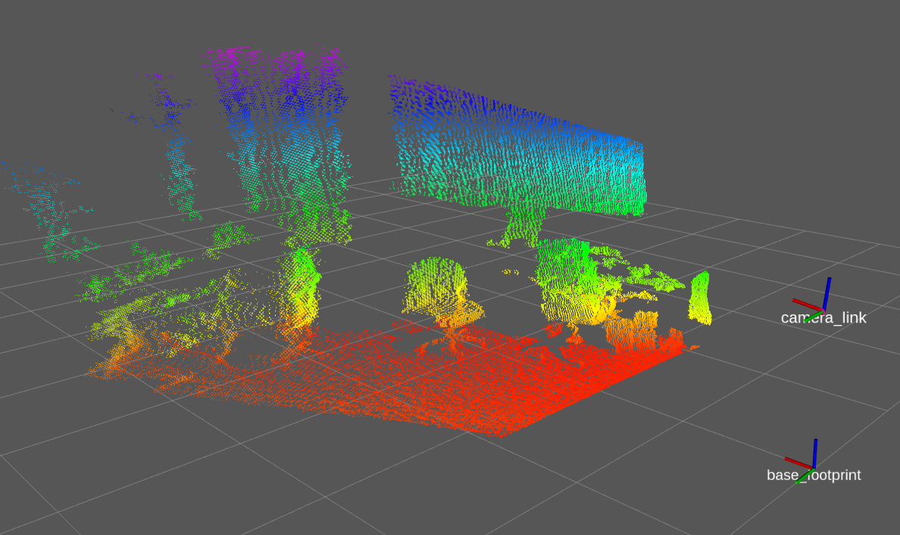

# Before Tutorial
## pointcloud_publisher

**これは，RGB-DセンサやLiDARの代わりのものです．**  

あらかじめ用意したセンサデータをPublishしてくれます．  
そのため，RGB-DセンサやLiDAR等のセンサを用意することなくTutorialを進めることができます．  
したがって，Tutorialは，pointcloud_publisher.launchを起動させた状態で行うこと．  

- [sample srcはこちら](../../src/others/pointcloud_publisher.cpp)  
- [sample launchはこちら](../../launch/pointcloud_publisher.launch)  

【 sample launch 】
```py
$ roslaunch pcl_tutorial_ros pointcloud_publisher.launch
```

launchを起動させると，センサデータがPublishされ，rviz上に表示される．


[目次に戻る](https://github.com/DaikiMin/pcl_tutorial_ros)