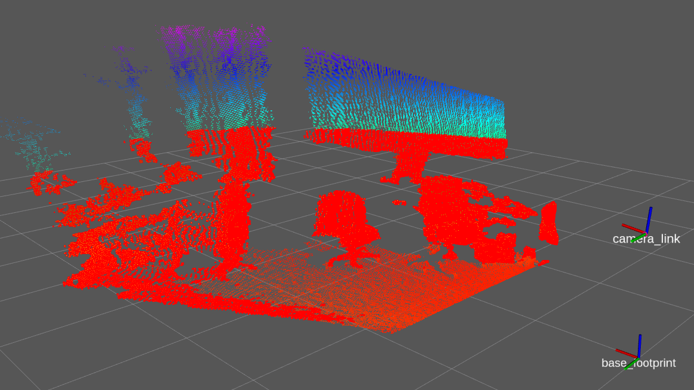

# PassThrough

PassThroughフィルタは得られた点群のうち，一定の範囲内にある点群のみを抽出します．  

探索範囲を限定することができ，XYZの各軸ごとに設定ができる．  
例えば，Z軸のみを探索する場合

```cpp
#include <pcl/filters/passthrough.h> 

pcl::PassThrough<pcl::PointXYZ> pass;       //pcl::PassThroughフィルタのインスタンスを追加
pass.setInputCloud (cloud);                 //PassThroughフィルタの対象になる点群データをセット
pass.setFilterFieldName ("z");              //Z軸（高さ）の値でフィルタをかける
pass.setFilterLimits (最小値,最大値);       //最小値 〜 最大値 [m] の間にある点群を抽出
pass.filter(*cloud_passthrough);            //対象になる点群データにPassThroughフィルタをかける
```

と設定する．
センサーの分解能にもよるがこの際，あまり小さな範囲でフィルターをかけてしまうと点群が得られない．
XYZすべてでフィルターをかけたい場合は，X，Y，ZそれぞれPassThroughの設定をし行う必要がある．

- [sample srcはこちら](../../src/basic/passthrough.cpp)  
- [sample launchはこちら](../../launch/basic/passthrough.launch)  

- [Documentationはこちら](https://pcl.readthedocs.io/projects/tutorials/en/master/passthrough.html)  

【 sample launch 】
```py
$ roslaunch pcl_tutorial_ros pointcloud_publisher.launch
```
```py
$ roslaunch pcl_tutorial_ros passthrough.launch
```

launchを起動させると，元のセンサデータからz軸に対してPassThroughフィルタがかかった点群がPublishされる．  
rvizの左(▶)にあるPassThroughの欄にチェックを入れると結果が表示される．  


[目次に戻る](https://github.com/DaikiMin/pcl_tutorial_ros)
