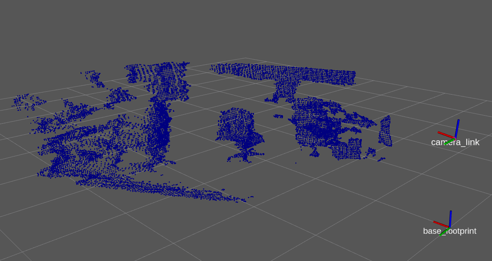

# VoxelGrid

３次元点群の処理には時間がかかることが多いため，低スペックのPCの場合はある程度点を間引いておいた方が都合が良いことがあります．  
VoxelGridフィルタは等間隔に点群をダウンサンプリングします．  

【 例 】
```cpp
#include <pcl/filters/voxel_grid.h>

pcl::VoxelGrid<pcl::PointXYZ> voxel;            //pcl::VoxelGridフィルタのインスタンスを追加
voxel.setInputCloud(cloud);                     //VoxelGridフィルタの対象になる点群データをセット
voxel.setLeafSize(間隔_x, 間隔_y, 間隔_z);      //間隔[m]でダウンサンプリング
voxel.filter(*cloud_voxel);                     //対象になる点群データにVoxelGridフィルタをかける
```

- [sample srcはこちら](../../src/basic/voxel_grid.cpp)  
- [sample launchはこちら](../../launch/basic/voxel_grid.launch)  

- [Documentationはこちら](https://pcl.readthedocs.io/projects/tutorials/en/master/voxel_grid.html)  

【 sample launch 】
```py
$ roslaunch pcl_tutorial_ros voxel_grid.launch
```

launchを起動させると，元のセンサデータより荒い点群がPublishされる．  
rvizの左(▶)にあるVoxelGridの欄にチェックを入れると結果が表示される．  


[目次に戻る](https://github.com/DaikiMin/pcl_tutorial_ros)
