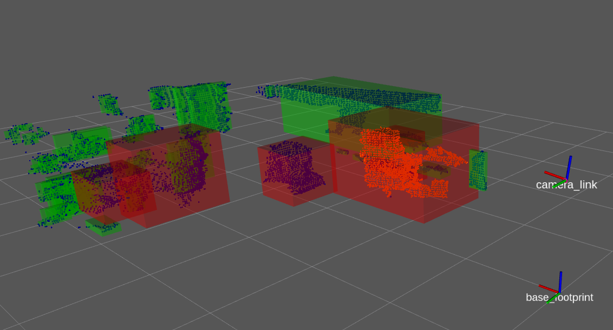

# Clustering
**クラスタリング**  

点群のクラスタリング（いくつかの塊に分離すること）により物体認識などをする際の物体領域候補が検出できます．
今回は、クラスタリングをして、特定の大きさに合致するクラスタの中から最も距離が近いクラスタを検出するプログラムを作成します

【 例 】
```cpp
#include <pcl/common/common.h>
#include <pcl/kdtree/kdtree.h>
#include <pcl/segmentation/extract_clusters.h>  

pcl::search::KdTree<pcl::PointXYZ>::Ptr tree (new pcl::search::KdTree<pcl::PointXYZ>);        //pcl::search::KdTreeのインスタンスを追加（ポインタ）
tree->setInputCloud (cloud_filtered);                 //KdTreeの対象になる点群データをセット

std::vector<pcl::PointIndices> cluster_indices;       //クラスタリングの結果が入る配列を作成
pcl::EuclideanClusterExtraction<pcl::PointXYZ> ec;    //pcl::EuclideanClusterExtraction（ユークリッドでのクラスタ抽出）のインスタンスを追加
ec.setClusterTolerance (0.02);                        //クラスタリングでの点群の幅を設定(m)
ec.setMinClusterSize (100);                           //クラスタの点群最小サイズ(個)
ec.setMaxClusterSize (25000);                         //クラスタの点群最大サイズ(個)
ec.setSearchMethod (tree);                            //クラスタリングする探索方法を設定
ec.setInputCloud (cloud);                             //クラスタ抽出の対象になる点群データをセット
ec.extract (cluster_indices);                         //クラスタ抽出
```

公式のDocumentationでは、各クラスタに対して処理や各クラスタをPointcloudに変換するときにfor文を用いているが，今回のTutorialでは、範囲for文に変更しました．
範囲for文の方が処理速度が速く，コードが読みやすいのでおすすめです．[(参考)](http://jagabeeinitialize.hatenablog.com/entry/2018/01/24/001016)  

各クラスタに対して処理を行うとき
```cpp
std::vector<pcl::PointIndices> cluster_indices;
for ( auto &cluster : cluster_indices ) {
        /* ここに処理を書く */
}
```

各クラスタをPointcloudに変換するとき
```cpp
std::vector<pcl::PointIndices> cluster_indices;
for ( auto &cluster : cluster_indices ) {
    pcl::PointCloud<pcl::PointXYZ>::Ptr cloud_cluster (new pcl::PointCloud<pcl::PointXYZ>);
    for ( auto& i : cluster.indices ) {
        cloud_cluster->points.push_back(cloud->points[i]);
    }
}
```

- [Documentationはこちら](https://pcl.readthedocs.io/projects/tutorials/en/master/cluster_extraction.html)  

- [sample srcはこちら](../../src/basic/clustering.cpp)  
- [sample launchはこちら](../../launch/basic/clustering.launch)  

※ [KdTree](https://pcl.readthedocs.io/projects/tutorials/en/master/kdtree_search.html#kdtree-search)

【 sample launch 】
```py
$ roslaunch pcl_tutorial_ros clustering.launch
```

launchを起動させると，クラスタリングが実行され，rviz上に各クラスタが黄緑の直方体，
特定の大きさに合致するクラスタは赤の直方体、その中で最も近いクラスタのみPointcloudに変換される．  
rvizの左(▶)にあるClusterの欄にチェックを入れると結果が表示される．


# Basic編まとめ
Basic編のsampleで用いたBasicPointCloudHandleクラスは,クラスの定義とそのメンバ関数の定義とをヘッダファイルとソースファイルとで分割してまとめてあります.  
是非、参考にしてください.  
- [BasicPointCloudHandleクラスの定義はこちら](/include/pcl_tutorial_ros/basic_point_cloud_handle.h)  
- [BasicPointCloudHandleクラスのメンバ関数の定義はこちら](/src/basic/basic_point_cloud_handle.cpp)  

[目次に戻る](https://github.com/DaikiMin/pcl_tutorial_ros)

