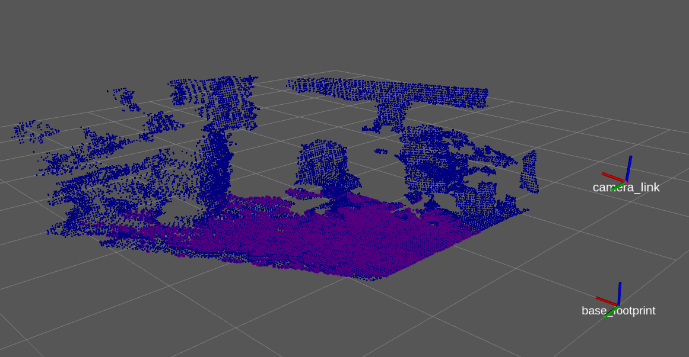

# Plane Detection

最も平面らしい点群を抽出します．  

【 例 】
```cpp
#include <pcl/sample_consensus/method_types.h>
#include <pcl/sample_consensus/model_types.h>
#include <pcl/segmentation/sac_segmentation.h>
#include <pcl/filters/extract_indices.h>

/* 平面検出 */
pcl::ModelCoefficients::Ptr coefficients (new pcl::ModelCoefficients);  //モデル係数
pcl::PointIndices::Ptr inliers (new pcl::PointIndices);                 //インライア
pcl::SACSegmentation<pcl::PointXYZ> seg;    //平面検出するためのインスタンスを追加
seg.setOptimizeCoefficients (true);         //モデル係数の詳細化を有効にするかどうか  
seg.setModelType (pcl::SACMODEL_PLANE);     //モデル　平面モデルを指定
seg.setMethodType (pcl::SAC_RANSAC);        //検出手法 RANSAC
seg.setDistanceThreshold (0.01);            //モデルしきい値（ユーザー指定のパラメーター）までの距離
seg.setProbability(0.95);                   //外れ値のないサンプルを少なくとも1つ選択する確率を設定(モデル適合確率)

seg.setInputCloud (cloud);                  //SAC_Segmentationの対象になる点群データをセット
seg.segment (*inliers, *coefficients);      //パラメータを求めて，範囲外の不適切な点を取り除いた点の集合を取得する

/* 検出されたインライアから点群を抽出 */
pcl::ExtractIndices<PointT> extract;        //点群除去するためのインスタンスを追加
extract.setInputCloud(cloud);               //抽出の対象になる点群データをセット
extract.setIndices(inliers);                //抽出の対象になる点一連のインデックスをセット
extract.setNegative(false);                 //除去の対象を設定 (true にすると平面を除去，false にすると平面以外を除去)
extract.filter(*cloud_plane);               //点群から一連のインデックスを抽出
```

- [sample srcはこちら](../../src/advanced/plane_detection.cpp)  
- [sample launchはこちら](../../launch/advanced/plane_detection.launch)  

- [Documentationはこちら](https://pcl.readthedocs.io/projects/tutorials/en/master/planar_segmentation.html)  

※ [RANSAC](https://qiita.com/smurakami/items/14202a83bd13e55d4c09)  

【 sample launch 】
```py
$ roslaunch pcl_tutorial_ros plane_detection.launch
```

平面以外にも様々なモデルの検出が可能である．
[こちらを参照](https://pointclouds.org/documentation/group__sample__consensus.html)  

launchを起動させると，平面検出が実行され，検出された点群がPublishされる．  
rvizの左(▶)にあるPlaneの欄にチェックを入れると結果が表示される．


[目次に戻る](https://github.com/DaikiMin/pcl_tutorial_ros)
