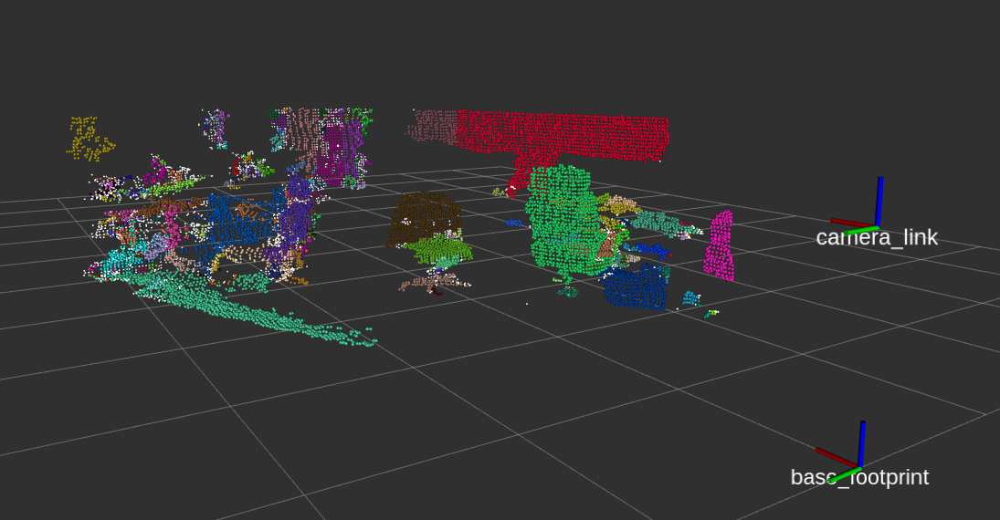

# Region growing segmentation

点群表面法線および曲率に基づいて領域分割を行います(同じ滑らかな表面をクラスタとしてクラスタリング)．  

```cpp
#include <pcl/search/search.h>
#include <pcl/search/kdtree.h>
#include <pcl/features/normal_3d.h>
#include <pcl/segmentation/region_growing.h>

typedef pcl::PointXYZ PointT;
typedef pcl::Normal NormalT;
typedef pcl::PointCloud<PointT> PointCloud;
typedef pcl::PointCloud<NormalT> NomalCloud;

PointCloud::Ptr cloud (new PointCloud());
NomalCloud::Ptr normals (new NomalCloud());     //表面の法線と曲率とともにXYZデータを保持するポイント構造

/* 表面法線の推定 */
pcl::NormalEstimation<PointT, NormalT> normal_estimator;                             //サーフェスの法線と曲率を推定するためのインスタンスを追加
normal_estimator.setSearchMethod (tree);            //探索方法を指定
normal_estimator.setInputCloud (cloud);             //対象の点群をセット
normal_estimator.setKSearch (50);                   //特徴推定に使用するk最近傍の数を設定
normal_estimator.compute (*normals);                //推定された特徴を出力

/* 領域分割 */
pcl::RegionGrowing<PointT, NormalT> reg;             //領域分割するためのインスタンスを追加
reg.setMinClusterSize (50);                         //クラスタの点群最小サイズ(個)
reg.setMaxClusterSize (1000000);                    //クラスタの点群最大サイズ(個)
reg.setSearchMethod (tree_);                        //探索方法を指定
reg.setNumberOfNeighbours (30);                     //近隣の数を設定
reg.setInputCloud (cloud);                          //対象の点群をセット
reg.setInputNormals (normals);                      //対象の特徴
reg.setSmoothnessThreshold (8.0 / 180.0 * M_PI);    //滑らかさのしきい値を設定(rad)
reg.setCurvatureThreshold (1.0);                    //曲率のしきい値を設定

std::vector <pcl::PointIndices> clusters;           //クラスター
reg.extract (clusters);                             //セグメンテーションアルゴリズムを起動
```

- [sample srcはこちら](../../src/advanced/region_growing_segmentation.cpp)  
- [sample launchはこちら](../../launch/advanced/region_growing_segmentation.launch)  

- [領域分割のDocumentationはこちら](https://pcl.readthedocs.io/projects/tutorials/en/master/region_growing_segmentation.html)  

- [表面法線のDocumentationはこちら](https://pcl.readthedocs.io/projects/tutorials/en/master/normal_estimation_using_integral_images.html)  

- [Reference](http://visitlab.jp/pdf/RegionGrowingPCL.pdf)  

【 sample launch 】
```py
$ roslaunch pcl_tutorial_ros region_growing_segmentation.launch
```

launchを起動させると，領域分割が実行され，PCLのvisualizationが起動し，結果を出力される．  
データ量が多いため，出力されるまでに時間がかかる．  
  

[目次に戻る](https://github.com/DaikiMin/pcl_tutorial_ros)