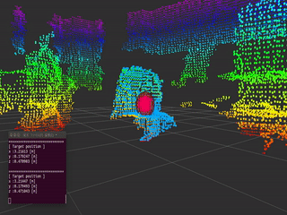

# Tracker
パーティクルフィルタベースでの物体追跡を行うライブラリpcl_trackingを用いて，リアルタイムでオブジェクトを追跡を行うプログラム

- [sample srcはこちら](../../src/advanced/tracker.cpp)  
- [PointCloudTrackerクラスの定義はこちら](../../include/pcl_tutorial_ros/point_cloud_tracker.h)  
- [PointCloudTrackerクラスのメンバ関数の定義はこちら](../../src/advanced/point_cloud_tracker.cpp)  

- [sample launchはこちら](../../launch/advanced/tracker.launch)  

sample srcでは，はじめにクラスタリングを用いて追跡対象となるオブジェクトをトラッカーに設定し，その後は，オブジェクトの追跡が開始されます．トラッカーの中身については，sample srcのPointCloudTrackerクラスを参照してください．

[pcl_trackingのDocumentationはこちら](https://pcl.readthedocs.io/projects/tutorials/en/master/tracking.html)  
[パーティクルフィルタについてはこちら1](http://www.thothchildren.com/chapter/5c7bc083ba4d5d6b2c2419ea)  
[パーティクルフィルタについてはこちら2](https://rest-term.com/archives/2846/)  
[パーティクルフィルタについてはこちら3](https://www.slideshare.net/garaemon/ueda-cv-saisentan)  

【 sample launch 】
```py
$ roslaunch pcl_tutorial_ros tracker.launch
```

<div align="center">
    
</div>
<center>水色のポイントクラウド：追跡結果  </center>  
<center>赤色のポイントクラウド：パーティクル    </center>  
<center>赤色の球体：追跡結果の重心   </center>  

[目次に戻る](https://github.com/DaikiMin/pcl_tutorial_ros)